# EZ Shop Ecommerce Website With Django + React

## Features
* Full featured shopping cart
* User profile with orders
* Email Verification
* Admin product management
* Admin user management
* Admin Order details page
* Admin can hide/show products on user side
* Mark orders as delivered option
* Checkout process (shipping, payment method, etc)
* PayPal / credit card integration

## Download & Setup Instructions

**These instructions are for Mac and Linux users. Instructions may differ for Windows users**

* 1 - Clone project:

      git clone https://github.com/bilal-zafarr/ecommerce-react-django.git
        
* 2 - Go to project directory:

      cd ./ecommerce-react-django

* 3 - Create virtual environment: 
        
      python3 -m venv venv
        
* 4 - Activate virtual environment: 
        
      source venv/bin/activate
        
* 5 - Install requirements: 

      python -m pip install -r requirements.txt
        
* 6 - Create .env file and add your environment variables using .env.example as a reference:

      cd ./backend/backend
      touch .env
        
* 7 - Run django server:
      
      cd ./..
      python manage.py runserver
        
* 8 - Open a new terminal and go to frontend directory:
 
      cd frontend

* 9 - Install dependencies:

      npm install
        
* 10 - Run react server:

      npm start

## Some Screens
#### Home Page
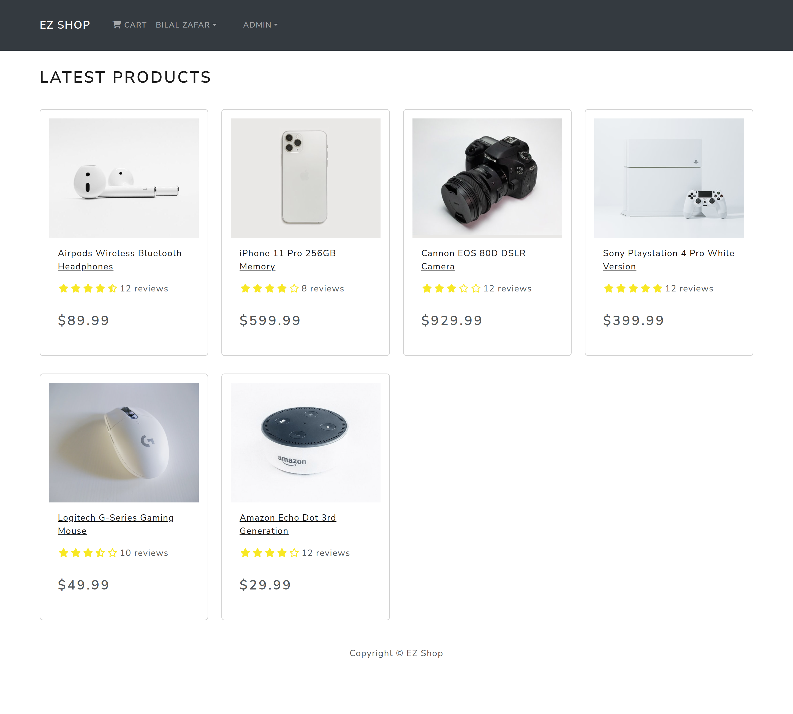

#### Product Page
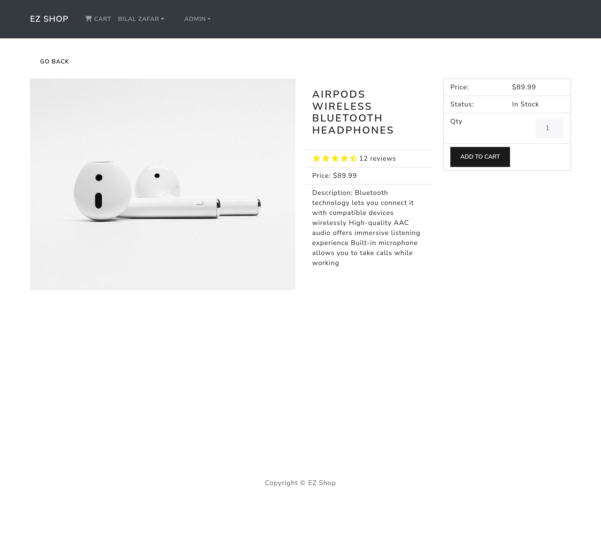

#### Cart Page
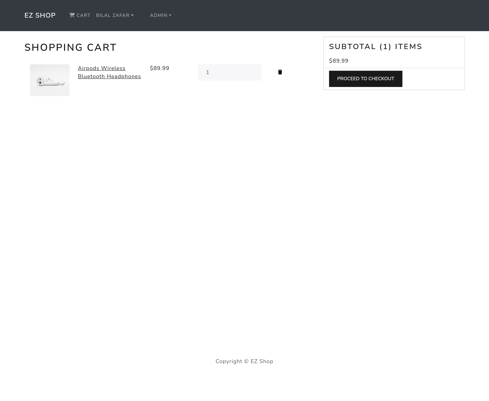

#### Login Page
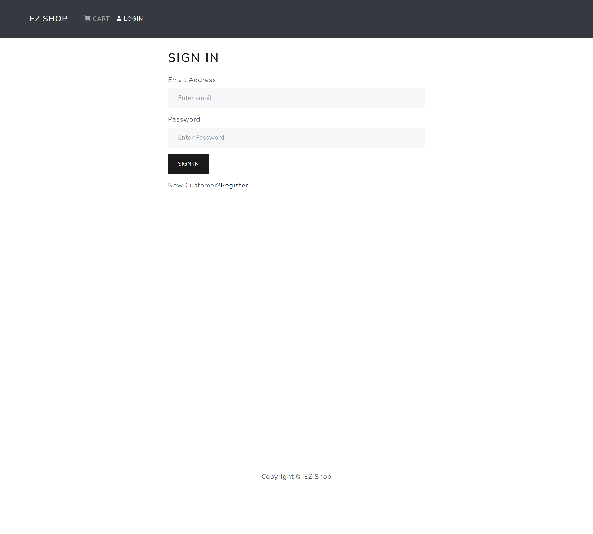

#### Shipping Page
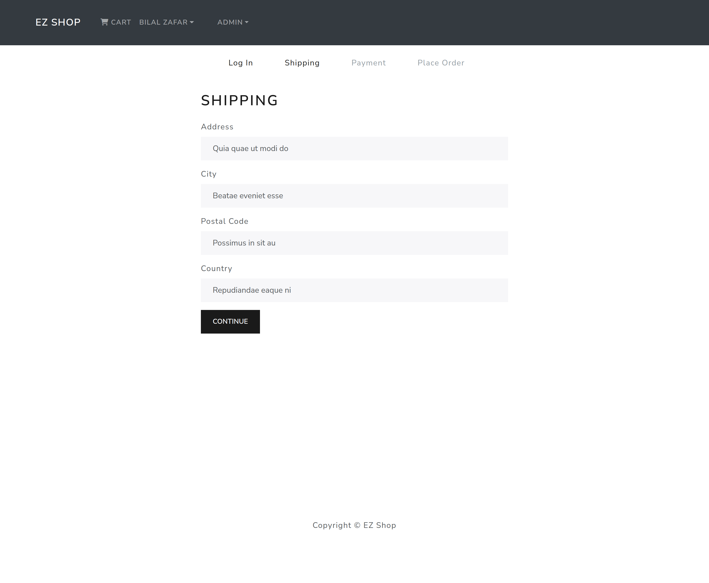

#### Payment Page
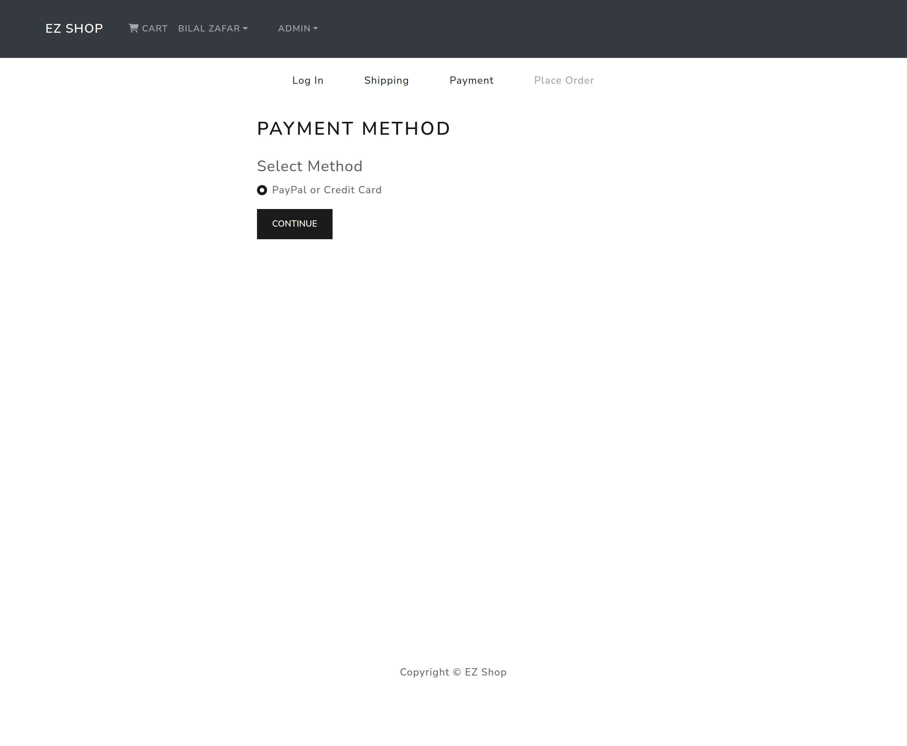

#### Order Page

#### Place Order Page
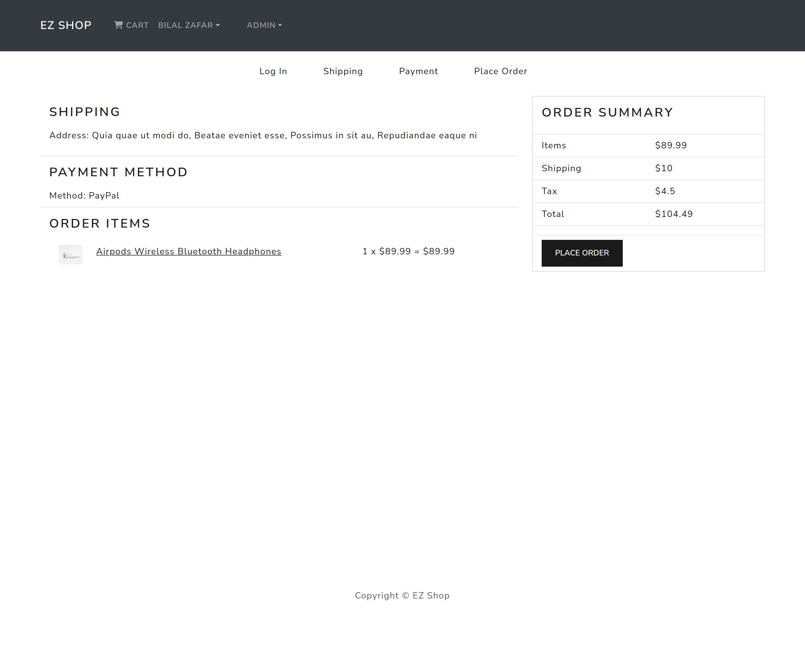

#### Profile Page
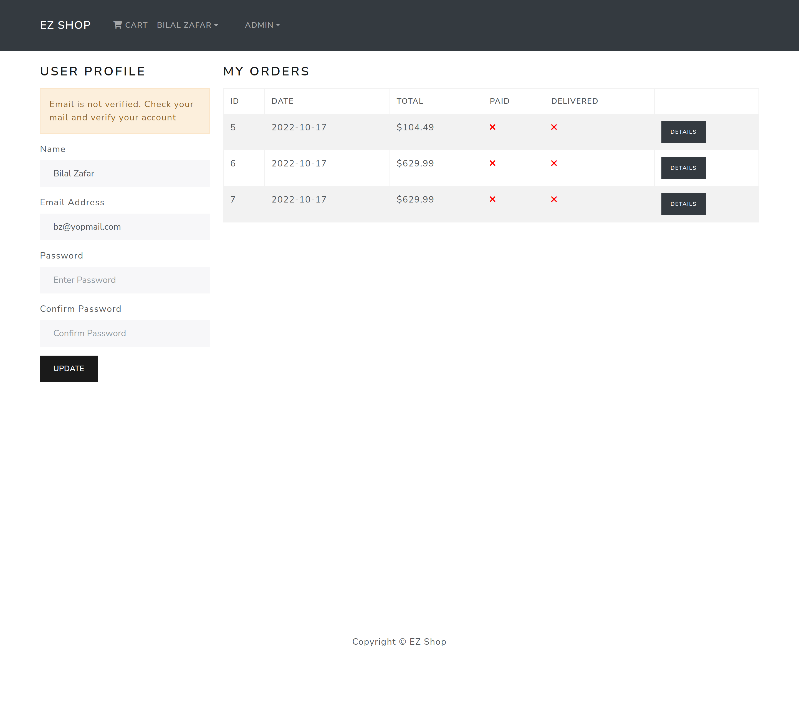

#### Users Page
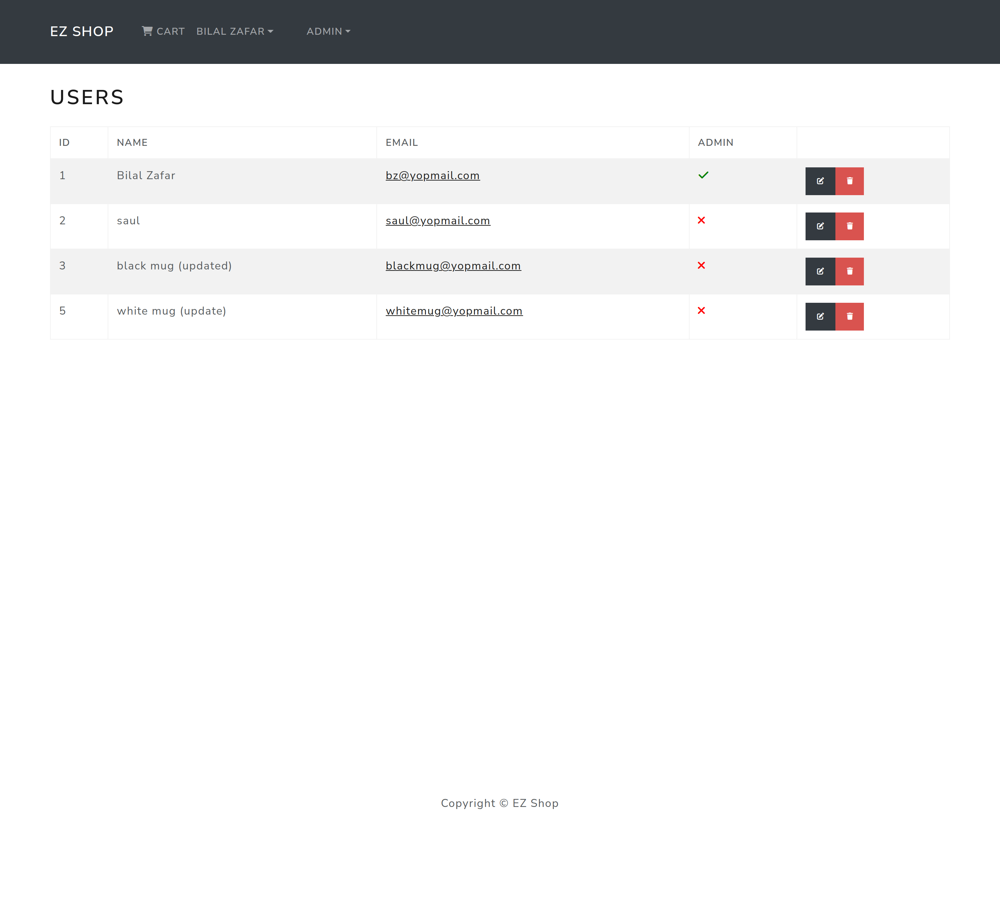

#### Products Page
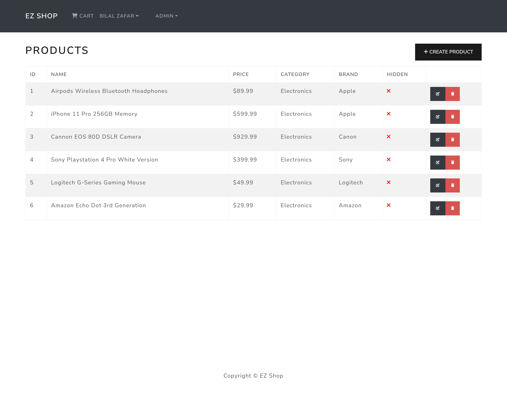

#### Orders Page
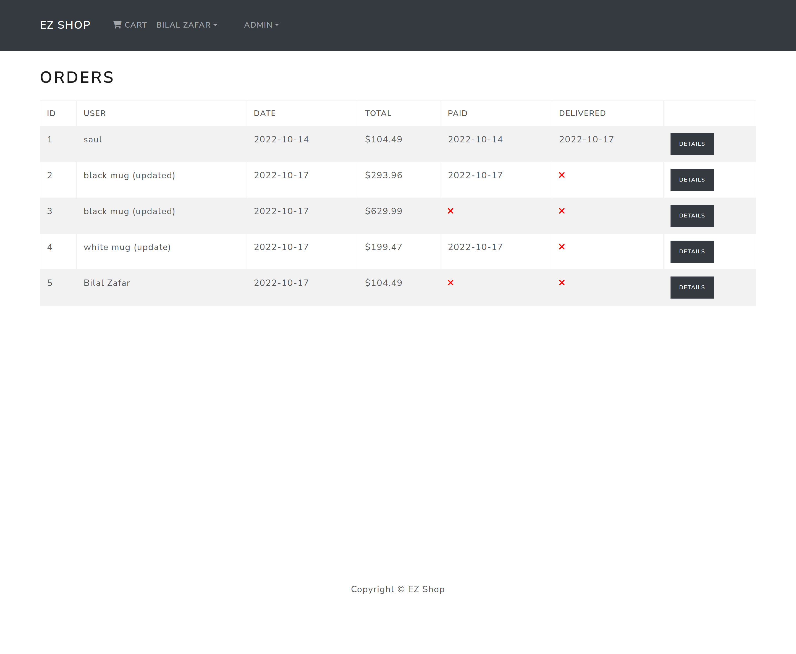
