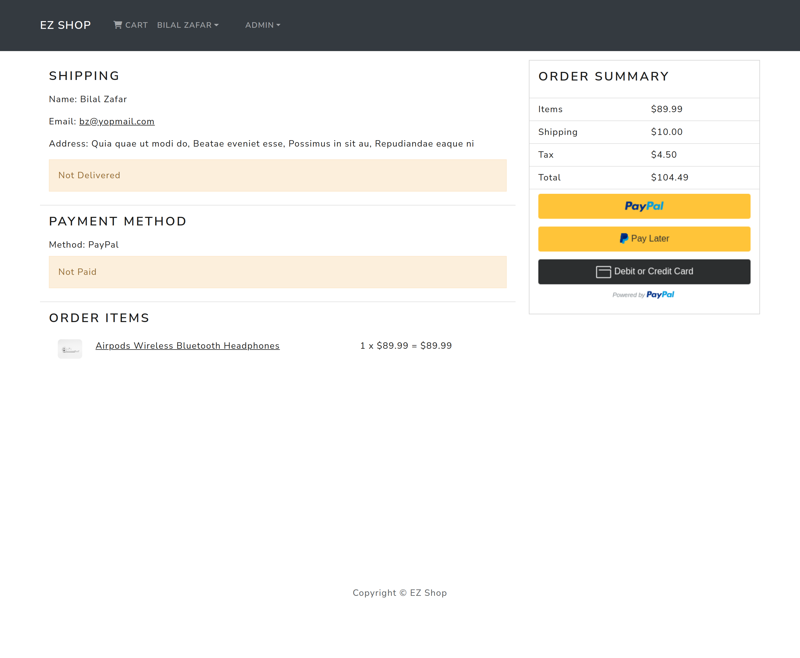

# EZ Shop Ecommerce Website With Django + React

## Features
* Full featured shopping cart
* User profile with orders
* Email Verification
* Admin product management
* Admin user management
* Admin Order details page
* Admin can hide/show products on user side
* Mark orders as delivered option
* Checkout process (shipping, payment method, etc)
* PayPal / credit card integration

## Download & Setup Instructions

* 1 - Clone project:

        ```bash
        git clone https://github.com/bilal-zafarr/ecommerce-react-django.git
        ```
* 2 - Go to project directory:

        ```bash
        cd ecommerce-react-django
        ```
* 3 - Create virtual environment: 
        
        ```bash
        python3 -m venv venv
        ```
* 4 - Activate virtual environment: 
        
        ```bash
        source venv/bin/activate
        ```
* 5 - Install requirements: 

        ```bash
        python -m pip install -r requirements.txt
        ```
* 6 - Create .env file and add your environment variables using .env.example as a reference:

        ```bash
        cd backend
        touch .env
        ```
* 7 - Run django server:

        ```bash
        python manage.py runserver
        ```
* 8 - Open a new terminal and go to frontend directory:

        ```bash 
        cd frontend
        ```
* 9 - Install dependencies:

        ```bash
        npm install
        ```
* 10 - Run react server:

        ```bash
        npm start
        ```

## Some Screens
#### Home Page


#### Product Page


#### Cart Page


#### Login Page


#### Shipping Page


#### Payment Page


#### Order Page


#### Place Order Page


#### Profile Page


#### Users Page


#### Products Page


#### Orders Page

